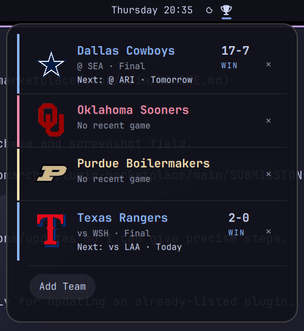

# Sportsbar

A bar widget for the [Omarchy](https://omarchy.org/) shell that tracks your
favorite sports teams. Pick up to 6 teams and the trophy pill in your bar
opens a popup showing each team's live/latest score and next upcoming
game, pulled from ESPN's public API — no account or key required.



Supported sports: NFL, NBA, NHL, MLB, Premier League, College Football,
College Basketball.

- **Live scores**: in-progress games show the current score and game state
  (e.g. "Top 9th", "Q3 4:12"), not just final results.
- **Team logos**: each card shows the team's real logo, or — if you added
  the team with `--ascii` — a plain-text ASCII rendering of it.
- **Theme-matched colors**: each team's card is accented with its real
  brand color, automatically snapped to the nearest swatch in whatever
  Omarchy theme is active, so it never clashes and re-colors itself on a
  theme switch.

## Settings

Configure from the bar widget's settings panel, or by editing its entry
under `bar.layout` in `~/.config/omarchy/shell.json`.

| Key             | Type    | Default | Description                                                                                     |
|-----------------|---------|---------|---------------------------------------------------------------------------------------------------|
| `colorizeTeams` | boolean | `true`  | Color each team's name and accent bar with its theme-matched brand color. Off shows plain text. |

## Usage

- **Click** the trophy pill to open/close the popup.
- **Middle-click** the trophy pill to force a refresh.
- **Add a team**: open the popup → "Add Team" → pick a sport, then a team.
- **Remove a team**: click the ✕ next to a team's card in the popup.
- Scores refresh automatically every 60 seconds while the popup is open.

The same actions are available from the command line via the bundled
`bin/omarchy-sportsbar` script:

```bash
bin/omarchy-sportsbar add                    # interactive: pick sport, then team
bin/omarchy-sportsbar add --ascii            # same, but store an ASCII-art logo instead of the real one
bin/omarchy-sportsbar remove                 # interactive: pick a favorite to remove
bin/omarchy-sportsbar add-direct <sport> <teamId> [--ascii]
bin/omarchy-sportsbar remove-direct <sport> <teamId>
bin/omarchy-sportsbar clear                  # forget all favorites
bin/omarchy-sportsbar detail                 # print current state as JSON
```

`sport` is one of `nfl`, `nba`, `nhl`, `mlb`, `prem`, `cfb`, `cbb`; `teamId`
is ESPN's numeric team id (`bin/omarchy-sportsbar teams <sport>` lists them).

`--ascii` renders the team's logo as plain-text ASCII art at add time and
stores it instead of the logo URL, so the card shows the ASCII version
from then on. Requires `img2txt` (from `caca-utils`) and ImageMagick; if
either is missing, or the render fails, it falls back to the real logo.

## Installation

```bash
omarchy plugin add https://github.com/cgmccarron/omarchy-sportsbar.git --enable
```

## Removal

```bash
omarchy plugin remove sportsbar
```

This deletes `~/.config/omarchy/plugins/sportsbar/` and disables the widget.
It does not clear your saved favorite teams or schedule cache; remove those
too if you want a clean slate:

```bash
rm -rf ~/.local/state/omarchy/settings/sportsbar.json ~/.cache/omarchy/sportsbar
```

## Dependencies

Everything below ships with a stock Omarchy install — nothing extra to
install:

- `bash`, `curl`, `jq`
- `omarchy-menu-select` and `omarchy-notification-send` (Omarchy's own
  picker/notification helpers, used for the interactive add/remove flows)

Optional, only needed for `--ascii`:

- `img2txt` (from the `caca-utils` package)
- ImageMagick (`magick` or `convert`)

## Data & storage

- Favorite teams: `~/.local/state/omarchy/settings/sportsbar.json`
- Per-team schedule cache (60s TTL): `~/.cache/omarchy/sportsbar/`
- Data source: ESPN's public `site.api.espn.com` JSON endpoints

## License

MIT — see [LICENSE](LICENSE).
